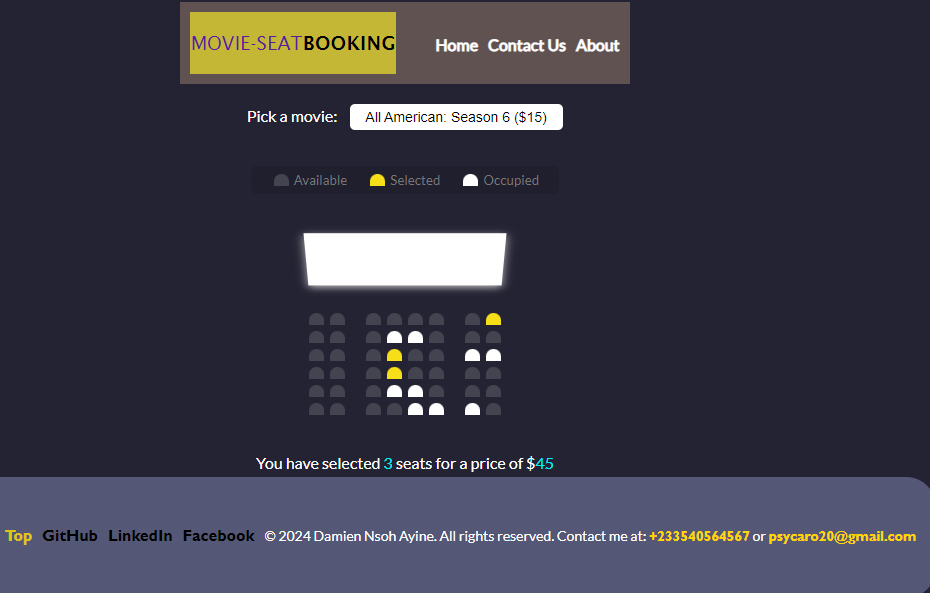

## Movie Seat Booking

Display movie choices and seats in a theater to select from in order to purchase tickets

## Project Specifications

- Display UI with movie select, screen, seats, legend & seat info
- User can select a movie/price
- User can select/deselect seats
- User can not select occupied seats
- Number of seats and price will update
- Save seats, movie and price to local storage so that UI is still populated on refresh

Design inspiration from [Dribbble](https://dribbble.com/shots/3628370-Movie-Seat-Booking)

## Technologies used
The application is being developed by technologies such as HTML, JavaScript, and CSS for the time being, further adustment will be made to the application as I will be using Python framework such as flask, and MySQL for data storage.

## Screenshots

## Github link
https://github.com/damiennsoh/Movie-Seat-Booking

## Deployed link
https://damiennsoh.github.io/Movie-Seat-Booking/